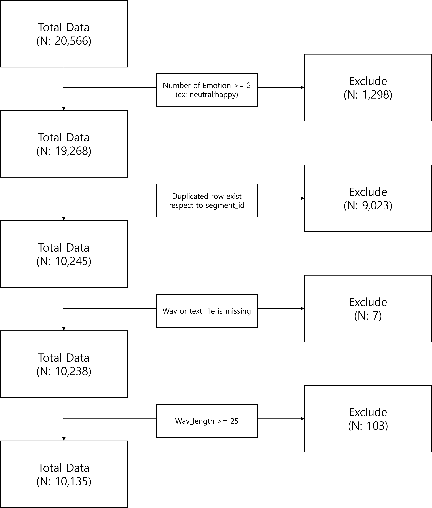
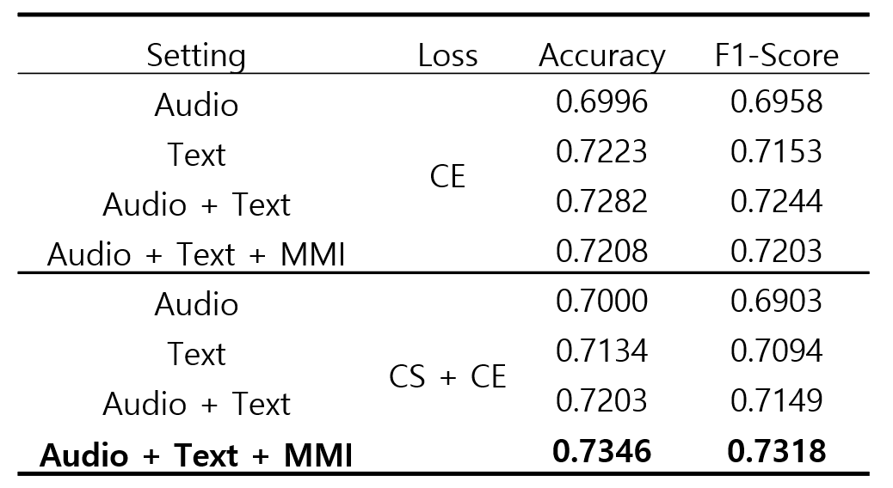

# Multimodal_Emotion_Recognition

MultiModal Emotion Recognition using Cross modal Interaction module and multiloss

- Data: [KEMDy19](https://nanum.etri.re.kr/share/kjnoh/KEMDy19?lang=ko_KR)
- Modality: Audio, Text

# Installation
## Requirements

- Linux
- Python 3.7+
- PyTorch 1.11.0 or higher and CUDA

a. Create a conda virtual environment and activate it.

```shell
conda create -n MER python=3.7
conda activate MER
```

b. Install PyTorch and torchvision following the [official instructions](https://pytorch.org/)

c. Clone this repository.

```shell
git clone https://github.com/Mirai-Gadget-Lab/Multimodal_Emotion_Recognition
cd Multimodal_Emotion_Recognition
```

d. Install requirments.

```shell
pip install -r requirements.txt
```

# Prepare for training

a. Prepare data 

- root_path: Original KEMD19 path Ex) /home/ubuntu/data/KEMD_19/
- save_path: save folder, default: ./data/

```shell
python preprocess.py --root_path your_KEMD_19_path --save_path ./data/
```

Here is the preprocess flow chart.

 

Note that, wav_length cliping is conducted in train_hf.sh or inference.py 


b. Set config

Change config.py for your environment.

But, i recommand default config setting.

# Train 

Run Training code

```shell
bash train_hf.sh
```

Check your GPU, and change train_hf.sh properly.

# Inference

if you train all the models, execute below codes.

```shell
CUDA_VISIBLE_DEVICES=0 python inference.py --model_save_path ./models_zoo/checkpoint/
```

Because pretarined model is very large, we share best model only.

you can download [pretrained model](https://drive.google.com/file/d/15UjgVC4avkNt-ZWCM4Hpdbibfh4EwfKM/view?usp=sharing)

In this case, you execute below code.

```shell
CUDA_VISIBLE_DEVICES=0 python inference_only_best.py --model_save_path ckp_save_path
```

# Result

 
